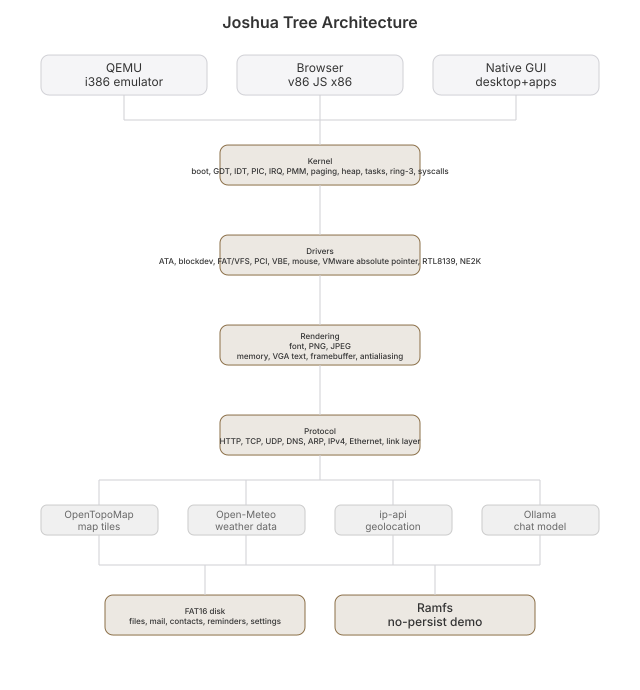

# Joshua Tree


 [](https://github.com/nulljosh/joshuatree)


[](https://github.com/nulljosh/joshuatree)
[](https://github.com/nulljosh/joshuatree/commits/main)

Live: [joshuatree.heyitsmejosh.com](https://joshuatree.heyitsmejosh.com)

A kernel. A small one, from nothing. It boots in QEMU, reads a real disk,
runs code loaded off it. Full breakdown: [`docs/ARCHITECTURE.md`](docs/ARCHITECTURE.md).

Renamed from `os`. The tree survives the Mojave on almost nothing, built
the same way this kernel is. Also a nod to the U2 album, and my own name.

| Piece | Where |
|-------|-------|
| Boot | `boot/boot.S`: multiboot1 header, temporary page tables to get into the higher half, jump to `kmain` (kernel runs at 0xC0000000+, loaded at 1MB) |
| Segments | `gdt.c`: flat GDT (ring-0 + ring-3 code/data, 4GB, plus a TSS) |
| Interrupts | `idt.c` + `isr.S`: IDT and the 32 CPU-exception handlers |
| IRQs | `pic.c`, `irq.c` + `irq_stubs.S`: PIC remap, IRQ-driven keyboard, PIT timer |
| Memory | `pmm.c` (physical frames), `paging.c` (identity + higher-half double-mapped paging), `kheap.c` (`kmalloc`/`kfree`) |
| Tasks | `task.c` + `irq_stubs.S`'s irq0: preemptive round-robin off the PIT tick, `yield()` reaches the same path in software via `int $32` |
| User mode | `ring3.c` + `ring3_asm.S`: real ring-3 privilege isolation, `ring3test` proves a privileged instruction faults instead of silently succeeding |
| Storage | `ata.c` (disk driver), `fat.c` (FAT16 read), `exec.c` (load+run a flat binary) |
| Filesystem abstraction | `vfs.c` + `blockdev.c`: real ops-table abstractions (v29, v33), each proven by a second, RAM-backed implementation (`ramfs.c`, `ramdisk.c`) |
| Networking | `pci.c` (enumeration) + `rtl8139.c` (NIC driver) + `net.c`: Ethernet/ARP/IPv4/UDP/TCP built up from raw frames, no routing table, one /24 link assumed |
| Browser | `http.c` + `html.c` + `json.c`: a plain-text HTTP client, a deliberately tiny HTML-to-text extractor, a JSON string-value grabber, glue over the two above (v8) |
| Images | `png.c`: minimal PNG decoder (8-bit RGB/RGBA and, since v75, 8-bit indexed/PLTE, the shape every real map tile server serves; non-interlaced) over a real zlib/DEFLATE inflater and all five scanline filters, CRC-32 and Adler-32 checked; `pngtest` decodes real PNGs cut from the wallpaper and compares every pixel (v74) |
| Wallpaper | `kernel.c` `wall_fetch`/`wall_apply`: a real topographic map of the machine's real location (ip-api.com lat/lon from v71, twelve OpenTopoMap tiles over plain HTTP, decoded by `png.c`, cropped centered on the town into the same 960x540 buffer the baked photo uses), the default since v75, with the photo as the fallback and a Settings/`wallpaper` toggle; `tools/checks/wallpaper-check.py` proves it byte-for-byte against the host's own download, `tools/checks/wallfx-check.py` proves rain still composites over it (v75) |
| Graphics | `vbe.c` (Bochs VBE mode switch + text-mode save/restore) + `font.c` (real CP437 font dumped from VGA hardware, DejaVu AA fallback) + `window.c` (the render-target abstraction everything draws through) |
| Apps | 7 built-in: Notes (`kernel/editor.h`), Reminders, Calendar, Mail, Contacts, Chat (`kernel/chat.h`, real Ollama `/api/chat` history) all VFS-backed; Calculator (`kernel/calculator.h`) pure logic; Stocks (`kernel/stocks.h`) static demo data. Plus 11 more ported natively from the fleet (`drivers/app_*.h`), served real over `serveapp <name>` and rendered as extracted text in the GUI |
| Trash | `trash.c`: a real, recoverable delete (v39), RAM-only, gone on reboot |
| Console | `kernel/kernel.c`: VGA text, keyboard, clock, the shell, a real mouse-driven GUI desktop (`gui`) |
| Link | `linker.ld`: flat ELF32 at 1 MB |
| Check | `check.sh`: boots it and checks the banner reached VGA memory |

## Progress


Regenerate after checking off `roadmap.md`: `./progress.sh`

## Build

```sh
brew install lld qemu
make run      # boots to the shell
./check.sh    # boot check
```

The Mac launcher and `make run` attach `dotfiles.img`. Run `./sync_dotfiles.sh`
to refresh its allowlisted, readable copies from `../dotfiles`. Fish and macOS
apps do not execute inside Joshua Tree yet.

Commands: `help` `clear` `echo` `time` `uptime` `dmesg` `mem` `reboot` `crash`
`pagefault` `heaptest` `heapgrow` `tasktest` `preempttest` `weathertest`
`weatherfxcliptest` `geotest` `wind`
`isotest` `reaptest` `ring3test` `ps` `kill` `killtest` `sleep` `disktest`
`diskuse` `fsuse` `ls` `cat` `exec` `rm` `cd` `mkdir` `write <file> <content>`
`browse` `lspci` `gfxtest` `fonttest` `mousetest` `nettest` `ifconfig` `netscan`
`web <host> [path]` `serve` `serveapp` `chat <message>` `build <what>` `gui`
`testapps`, most exist to manually exercise a subsystem (see
`docs/ARCHITECTURE.md`), not just to be useful. `web` and `gui` are worth
trying: `web` does a real DNS lookup and TCP connection over the network
stack in this repo, no libc, no OS underneath; `gui` opens a real
mouse-driven desktop with working apps.

## Voice control

`tools/voice-control.sh` is a host-side script (not part of the kernel, see
`roadmap.md`'s v10 note on why voice stays outside it): speak a request, a
local Ollama model maps it onto one of the kernel's real commands, and it
gets typed into a running QEMU instance through its monitor socket. Start
the kernel with a monitor socket first:

```sh
qemu-system-i386 -kernel kernel.elf -display none \
  -monitor unix:/tmp/jt-monitor.sock,server,nowait \
  -netdev user,id=n0 -device rtl8139,netdev=n0
tools/voice-control.sh          # records 4s, or: voice-control.sh 6
```

Needs `sox` (`rec`), `whisper-cpp` (`whisper-cli` plus a downloaded
`ggml-*.bin` model), and Ollama running locally with `llama3.1:8b`.

## Architecture



QEMU's `-kernel` loads it directly. No bootloader, no ISO. Full subsystem
breakdown, boot sequence, and what's deliberately not built yet (and why):
[`docs/ARCHITECTURE.md`](docs/ARCHITECTURE.md). Plan and ETAs: `roadmap.md`.

## License

Apache License 2.0, © 2026 Joshua Trommel
