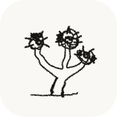
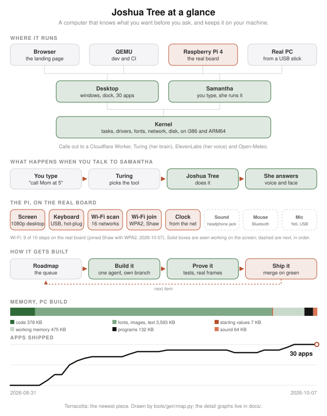

# Joshua Tree


A computer's brain, built from scratch.

Every computer runs an operating system. It's the part that wakes up when you press the power button, draws the screen, hears the keyboard, saves your files and runs your apps. Windows, macOS and Android are operating systems. Most new ones are built on top of Linux, borrowing its heart.

Joshua Tree borrows nothing. Every line, from the first instruction the chip runs to the last pixel on screen, was written for it. It has its own windows, its own dock, its own fonts, sound and internet, and 25 apps.

Try it right now, in your browser: [joshuatree.heyitsmejosh.com](https://joshuatree.heyitsmejosh.com)

And you can talk to it. Ask Samantha to set a reminder, take a note or open an app, and she does it, out loud, with a face that talks while she speaks. (Samantha is the assistant from [Turing](https://github.com/nulljosh/turing), a separate project. Joshua Tree is the machine she runs.)

What you save stays saved. Every feature has a test behind it ([here is what each one checks](docs/TESTING.md)).

## How it fits together

Top to bottom: where it runs, what you see, the engine underneath, the parts that talk to hardware, the outside services it calls, and where your files live.



## Boot it

**Browser:** [joshuatree.heyitsmejosh.com](https://joshuatree.heyitsmejosh.com) -- on a phone, the demo boots straight into Samantha, full screen.

**USB stick:** Download from [Releases](https://github.com/nulljosh/joshuatree/releases), then:
```sh
# macOS: find the disk with `diskutil list`, then
sudo dd if=joshuatree-X.Y.Z.iso of=/dev/rdiskN bs=4m
# Linux: find the device with `lsblk`, then
sudo dd if=joshuatree-X.Y.Z.iso of=/dev/sdX bs=4M status=progress conv=fsync
```
Boot from USB (F12/F10/Esc/Del at power-on).

Talk to her: `make talk`, hold **F2**, speak. (Real hardware and a real mic only -- QEMU's own Sound Blaster emulation has no recording path today, so a real "hearing" Samantha only exists on real hardware or a card QEMU emulates more fully; see `kernel/chat.h`.)

## Build it

For programmers. On a Mac:

```sh
brew install lld qemu
make run              # boot to shell; type gui for desktop
make samantha         # boot straight into Samantha, full screen, input focused
make talk             # boot with a real Sound Blaster on this Mac's mic/speakers
make iso              # build bootable ISO
./check.sh            # run regression tests (every check: docs/TESTING.md)
./tools/bench.sh      # boot time, heap, memcpy, context switch, disk
```

## How fast

Measured headless in QEMU on a Mac Mini M4 by `tools/bench.sh`. Run it yourself; the numbers move with the host.

<!-- bench:start -->
| Benchmark | Result |
|---|---|
| Boot to shell | 250 ms |
| Alloc + free | 65 ns/op |
| memcpy | 777 MB/s |
| Context switch | 2797 ns/switch |
| Disk read | 11443 KB/s |
<!-- bench:end -->

## Read more

- [docs/WHITEPAPER.md](docs/WHITEPAPER.md) - why and how
- [docs/ARCHITECTURE.md](docs/ARCHITECTURE.md) - every file
- [docs/talk-flow.svg](docs/talk-flow.svg) - what happens when you talk to Samantha
- [docs/memory-map.svg](docs/memory-map.svg) - where everything sits in memory (redraw: `tools/gen/memory-map.py`)
- [docs/TESTING.md](docs/TESTING.md) - every test and what it proves
- [docs/BENCHMARKS.md](docs/BENCHMARKS.md) - how fast it is
- [SECURITY.md](SECURITY.md) - security model
- [docs/THREAT-MODEL.md](docs/THREAT-MODEL.md) - threat model
- [docs/roadmap.md](docs/roadmap.md) - what's next

Apache License 2.0, © 2026 Joshua Trommel
