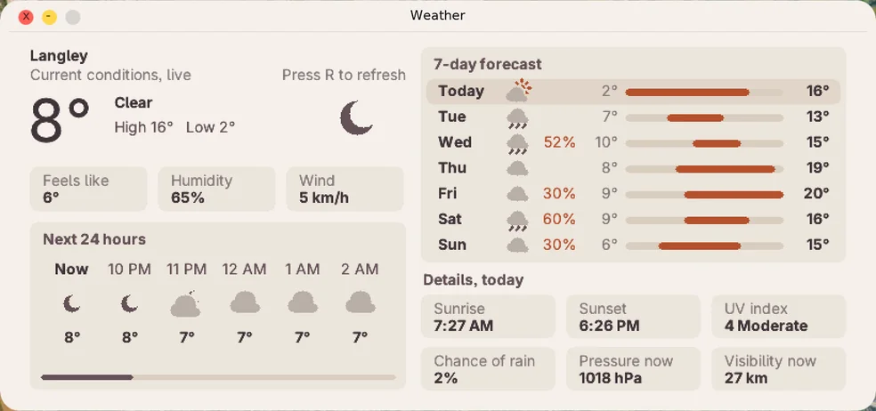
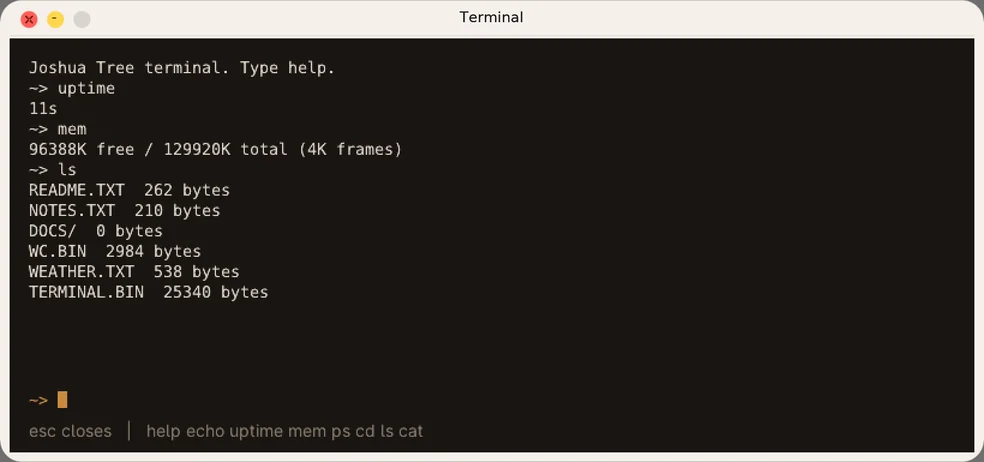

<picture>
  <source media="(prefers-color-scheme: dark)" srcset="https://github.com/nulljosh/joshuatree/releases/download/4.6.1/jt-mark-paper.png">
  
</picture>

# Joshua Tree

A small operating system with its own windows, dock, sound, internet and 32 apps. It runs in your browser, in an emulator on a Mac, and on a Raspberry Pi 4. Samantha, the assistant from [Turing](https://github.com/nulljosh/turing), runs on it and answers out loud through a relay on your Mac. On the Pi, talking to her through a USB mic is being tested on the real board.

  
  
  

## Try it

- In a browser: open [joshuatree.jaybulb.com](https://joshuatree.jaybulb.com).
- On a PC: boot the [latest ISO](https://github.com/nulljosh/joshuatree/releases/latest/download/joshuatree.iso) ([checksums](https://github.com/nulljosh/joshuatree/releases/latest/download/SHA256SUMS)). BIOS boot is checked in QEMU. UEFI and real PCs are not.
- On a Pi 4: flash a card with `tools/flash-pi.sh` ([steps](docs/GUIDE.md#raspberry-pi)).
- To build it: `brew install lld qemu`. Then `make run` to boot and `./check.sh` to test.

## How fast

Measured headless in QEMU by `tools/bench.sh`. The numbers move with the host.

<!-- bench:start -->
| Benchmark | Result |
|---|---|
| Boot to shell | 260 ms |
| Alloc + free | 172 ns/op |
| memcpy | 756 MB/s |
| Context switch | 3233 ns/switch |
| Disk read | 9674 KB/s |
<!-- bench:end -->

## Docs

- [Guide](docs/GUIDE.md): using it, the Raspberry Pi, building the hardware.
- [Architecture](docs/ARCHITECTURE.md): how it is built, design rules, system calls, security, tests.
- [Roadmap](docs/ROADMAP.md): what is next, what shipped, the story.

## License

[Apache License 2.0](LICENSE)
