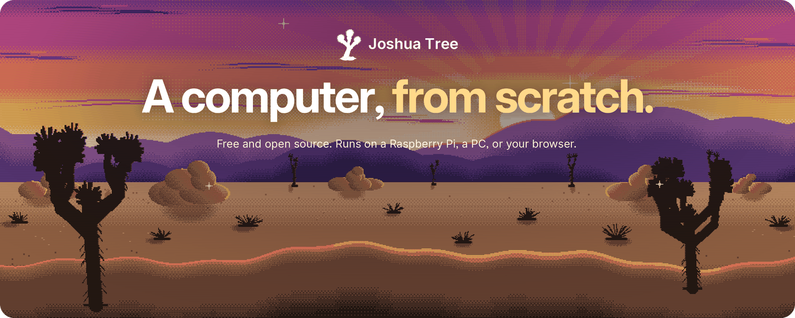

  

  
  
  

## Try it

- **Browser:** [joshuatree.jaybulb.com/?demo](https://joshuatree.jaybulb.com/?demo)
- **Pi 4:** `tools/flash-pi.sh` ([steps](docs/GUIDE.md#raspberry-pi))
- **Build:** `brew install lld qemu`, then `make run`

## Docs

[Guide](docs/GUIDE.md) · [Architecture](docs/ARCHITECTURE.md) · [Roadmap](docs/ROADMAP.md) · [Testing](docs/TESTING.md)

## License

[Apache 2.0](LICENSE)
