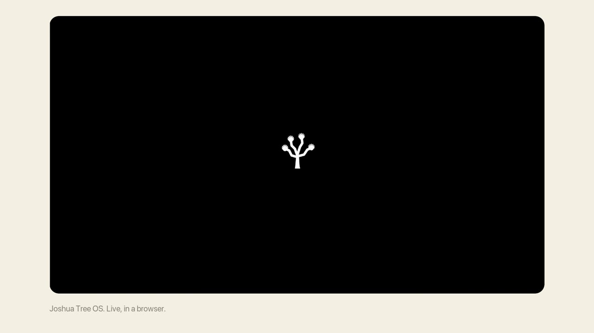

# Demo

A 36 second ad for Joshua Tree, now in the Claude release look: cream and clay fields, the product in a rounded frame, quiet captions. Click the picture to play it.

Samantha narrates it herself. The OS shots are the real system, recorded
from the live site booting in a browser. The case is Mesa, rendered from
the CAD file in [HARDWARE.md](HARDWARE.md#enclosure-mesa). It's a concept:
nothing has been built or priced by a shop yet, and the ad says so on
screen.

## What she says

> This is Joshua Tree.
> Every line of its operating system, written from scratch.
> The kernel. The windows. The apps.
> It lives in Mesa.
> Six layers, like the desert it's named after.
> The gaps are how it breathes.
> And the tree is cut into the top. Just enough to find it.
> Mail. Notes. Weather. Twenty seven apps in all.
> And me.
> Hi. I'm Samantha.
> Joshua Tree. Join the waitlist.

Every line matches a shot. "Weather" replaced "Stocks" because the
recording had no Stocks window on screen.

## How it's made

| Piece | Tool | File |
|---|---|---|
| Case shots: push-in, turntable, rings lifting apart, the engraved tree, end card | Blender, headless | `hardware/ad/anim.py` |
| OS footage | Playwright recording the live site | recorded fresh each cut |
| Voice | ElevenLabs, Samantha's voice | `hardware/ad/ad.txt` |
| Music | Original, 120 BPM, written in code: claps, piano hook, electric piano, round bass | `hardware/ad/music2.py` |
| Cut, type, mix | ffmpeg, San Francisco type | `hardware/ad/edit.py` |

The music ducks about 4 dB under her voice. An earlier cut ducked it 12 dB
and you couldn't hear it on a phone.
