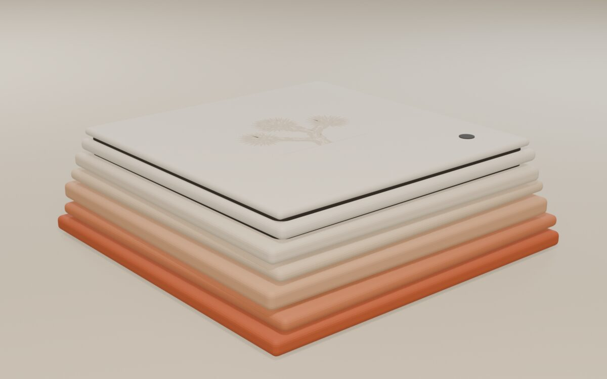
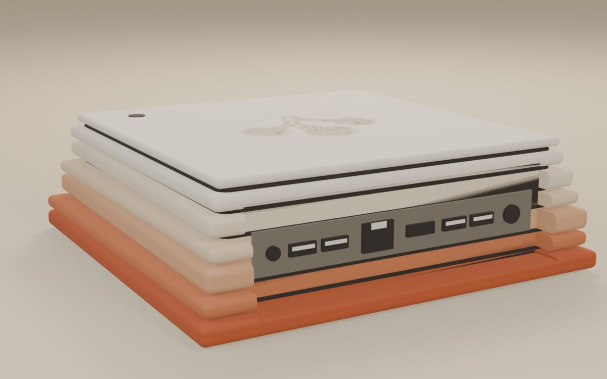
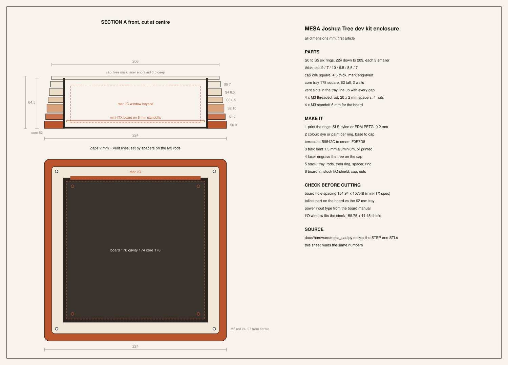

# Hardware

3.0 is "it boots a real computer." One reference mini PC: UEFI, USB
keyboard, mouse and stick, a real disk, a real network card, real sound.
This page picks that board, lists the driver work between here and
there, and says what a dev kit costs.

Everything the kernel talks to today is a QEMU-emulated device: rtl8139
or ne2k NIC, Sound Blaster 16, ATA PIO disk, PS/2 keyboard and mouse, a
multiboot/VBE linear framebuffer. None of those chips ship on a board
you can buy in 2026. This page is the bridge.

## The pick

**ASRock J4125B-ITX** (Gemini Lake Refresh, Intel Celeron J4125, mini-ITX,
current on ASRock's site: <https://www.asrock.com/mb/Intel/J4125B-ITX/index.asp>).

Why this one over a fixed-board SBC like an ODROID: it is a real
motherboard you buy new, drop into a case with a PSU and a SATA drive,
and it still ships with **separate PS/2 keyboard and mouse ports on the
rear I/O** (source: search results for the J4125-ITX manual, same rear
I/O layout carried into the B revision -
<https://www.manualslib.com/manual/3159314/Asrock-J4125-Itx.html> -
unverified against the B-revision manual directly, flagged below). PS/2
means the kernel's existing PS/2 driver can bring up input on day one,
before xHCI/HID exists at all. Hobbyist SBCs like the ODROID-H2/H3/H4
series are USB-only for input and, per Hardkernel's own forum, do not
support CSM/legacy boot (source:
<https://forum.odroid.com/viewtopic.php?t=39298>) - worse for this
kernel, not better, despite being the more obvious "small dev board"
answer.

| Chip | Model | Source | Confidence |
|---|---|---|---|
| CPU/SoC | Intel Celeron J4125 (Gemini Lake Refresh) | ASRock spec page | sourced |
| NIC | Realtek RTL8111H (Gigabit, PCIe) | ASRock spec page (J4125-ITX, carried to B) | sourced |
| Audio codec | Realtek ALC892, 7.1-channel HD Audio | ASRock spec page | sourced |
| SATA | 2x native SATA3 (SoC) + 2x SATA3 via ASMedia ASM1061 | ASRock spec page | sourced |
| USB | USB 3.2 Gen1 rear ports + USB 2.0 headers | ASRock spec page | sourced |
| Input (rear I/O) | Separate PS/2 keyboard port + PS/2 mouse port | J4125-ITX manual (ManualsLib mirror) | unverified for the B-revision board specifically |
| Legacy BIOS/CSM | AMI UEFI BIOS, CSM availability not confirmed for Gemini Lake Refresh boards | ASRock forum reports CSM missing on the related J4105/J5005 boards (<https://forum.asrock.com/forum_posts.asp?TID=8080>, <https://forum.asrock.com/forum_posts.asp?TID=8472>) | unverified for J4125B-ITX, must test in Phase 0 |
| Price | ~$113-$130 USD, board only | Beach Audio / Walmart listings, stock fluctuates | sourced, price only, availability unverified today |

**If CSM is missing** (real risk, see table): GRUB2 in UEFI mode can
still hand a multiboot kernel control the same way it does in QEMU today
- the kernel does not call BIOS interrupts after boot, it uses the
framebuffer GRUB already set up. The dependency on "legacy beats UEFI"
is really a dependency on GRUB working at all on the board, not on CSM
itself. Phase 0 below is exactly the test that settles this.

**Fallback: ODROID-H2+** (Gemini Lake, Intel Pentium/Celeron, SBC form
factor, official page: <https://www.hardkernel.com/shop/odroid-h2/> -
marked DISCONTINUED by Hardkernel; secondhand/eBay only as of this
writing). Dual 2.5GbE via Realtek RTL8125B, ALC662 audio, on-board
mSATA/SATA. Falls back to this only if the ASRock board's GRUB boot
fails outright in Phase 0 - it is USB-only for keyboard/mouse, so it
needs xHCI+HID working before any input at all, a strictly harder first
step.

## Driver gap table

| Chip on the pick | Kernel has today | Roadmap item | Effort |
|---|---|---|---|
| Realtek RTL8111H (Gigabit NIC) | rtl8139 (10/100, different register set) and ne2k | "Wired internet on real PCs: an Intel e1000 driver next to rtl8139 and ne2k" (docs/roadmap.md, Our own computer) - RTL8111 needs its own r8169-family driver, a sibling to that item, not the same chip | Medium. Same DMA-ring shape as rtl8139, different chip IDs, descriptor format and PHY init. A few days for someone who already wrote the rtl8139 driver. |
| ASM1061 / on-SoC SATA (AHCI) | ATA PIO (no AHCI, no DMA rings) | "AHCI for real SATA disks, on top of the e1000 work above" (roadmap) | Large. AHCI is a different command model (NCQ, command lists in memory) from PIO byte-banging. This is the biggest single item before "a real disk" is true. |
| ALC892 (Intel HDA bus) | SB16 (ISA, QEMU-only) | "Sound on real PCs: an AC97 or Intel HD Audio driver next to the Sound Blaster one" (roadmap) | Medium-large. HDA is PCI, ring-buffer based, codec-negotiated - closer in shape to the NIC work than to SB16's port I/O. |
| PS/2 keyboard/mouse (rear I/O, if present) | PS/2 driver exists and works in QEMU | none needed if the pick's PS/2 ports are real | None, if verified in Phase 0. This is the reason for the pick. |
| USB 3.2 xHCI (rear ports, for a boot stick and later HID/storage) | None | "xHCI USB host controller. Everything below hangs off it." (roadmap, first item under Our own computer) | Large. xHCI is the most complex controller here: ring-based TRBs, device enumeration, class drivers on top (HID, mass storage). Unavoidable long-term even with PS/2 covering input, because the boot stick itself is USB. |
| Intel UHD Graphics 600 (framebuffer) | Multiboot/VBE linear framebuffer, chipset-agnostic | none - GRUB sets the mode, kernel just writes pixels | None expected. This is the one piece that should just work, because GRUB (not the kernel) talks to the GPU. Phase 1 gate below proves it. |

## Bring-up order

Each phase ends in something you can point a camera or a log file at.
Do them in this order; do not start a phase until the previous one's
gate is met.

**Phase 0 - it boots at all.**
Flash the ISO to a USB stick, boot the board, and get *any* output: a
GRUB menu on screen, or a boot log over a serial cable if the screen
stays black. This is also where the CSM question above gets answered
for real.
Gate: a photo of the GRUB menu on the board's monitor, or a captured
serial log showing `kmain` starting.

**Phase 1 - the framebuffer.**
Same multiboot/VBE path QEMU already uses; the difference is whether
this specific Intel UHD 600 + GRUB combination hands back a usable
linear framebuffer address and mode.
Gate: the desktop wallpaper or shell prompt visible on the board's own
monitor, photographed.

**Phase 2 - input.**
PS/2 keyboard and mouse, if the port table above holds up. Type in the
shell, move a window.
Gate: a photo or short video of a command typed and executed on the
board.

**Phase 3 - storage.**
ATA PIO first against a real SATA disk in IDE-compat/legacy mode if the
board's BIOS offers it (many boards still do, even without full CSM) -
this proves "a real disk" without waiting on AHCI. AHCI work lands after,
as its own item.
Gate: `check.sh`-equivalent file write/read round-trip on the board,
logged.

**Phase 4 - network.**
RTL8111H driver up, DHCP or a fixed IP, a ping out.
Gate: a captured `ping` or an HTTP fetch from Samantha's chat, screen
recorded.

**Phase 5 - sound.**
HDA driver, the existing 1.6.9 audio path re-pointed at it instead of
SB16.
Gate: audio recording of the board playing back Samantha's voice or the
boot chime.

Each gate should be a file checked into the repo (photo, log, or a
`tools/checks/*.py` script's output), same discipline as every other
roadmap item here.

## Test rig

Iterating on real hardware without reflashing a USB stick every time is
the actual blocker, not any single driver. Plan:

- **Serial log is the priority over video.** A USB-to-TTL serial adapter
  (~$8-10, any FTDI-chip one) into the board's header if it has one, or a
  PCIe/USB serial card if not, gives a boot log without a monitor. This
  is how Phase 0 gets debugged without guessing from a black screen.
- **USB boot loop.** Keep two USB sticks: one known-good (last verified
  ISO) to fall back to, one for the build under test. `make iso` already
  produces the image; the loop is copy-to-stick, boot, note the result,
  repeat.
- **A board-side check script.** Once Phase 3 (storage) lands, a small
  `tools/checks/hwcheck.sh`-style script that runs from the board itself
  and writes its pass/fail to disk, so results survive a reboot instead
  of living only in someone's head. Not built yet - first real item once
  the board is in hand.
- **Network log, once Phase 4 lands.** After the NIC driver works, the
  kernel can push its own boot log to a listener on the LAN, which beats
  serial for convenience (no cable to the desk) but can't replace it for
  debugging Phase 0-3, when there's no network yet.

## Dev kit v0 BOM

Board-only prices, USD, gathered 2026-09-28. Stock and price move; treat
this as a snapshot, not a quote.

| Part | Pick | Price | Source |
|---|---|---|---|
| Motherboard + CPU | ASRock J4125B-ITX | ~$120 | Walmart/Beach Audio listings (estimate range $113-$130, stock fluctuates) |
| RAM | 8GB DDR4 SO-DIMM | ~$25 | generic current market price, estimate |
| Storage | 128GB SATA SSD | ~$20 | generic current market price, estimate |
| Case (mini-ITX) | generic mini-ITX case with a slot for the board's rear I/O | ~$40 | estimate |
| PSU | picoPSU or mini-ITX-compatible internal PSU | ~$30 | estimate |
| USB stick (ships pre-flashed with the ISO) | 16GB | ~$8 | estimate |
| Cables/misc (SATA cable, screws) | - | ~$7 | estimate |
| **Total (parts)** | | **~$250** | mostly estimate, board price is the only line with a real listing behind it |

This is a build-it-yourself BOM, not the $199 dev kit price - it is
already above $199 before labor, assembly, packaging and shipping are
added. MONEY.md resolves it with two boxes: a $199 Mesa Kit (case and OS
stick, you bring the board) and a $349 Mesa Complete.

## Risks and unknowns

- **CSM/legacy BIOS on the J4125B-ITX is unverified.** Related Gemini
  Lake boards (J4105-ITX, J5005-ITX) have user reports of no working
  CSM/legacy boot mode. If GRUB still boots the kernel in pure UEFI mode
  (likely, per the note above), this may not matter - but it is
  Phase 0's whole job to find out on the real board, not on paper.
- **Board availability.** J4125B-ITX shows out-of-stock at multiple
  retailers as of this writing. The dev kit BOM assumes it is buyable;
  if it goes fully EOL before Joshua orders one, the fallback (ODROID-H2+,
  also discontinued, secondhand-only) is worse, not better. A third
  option may be needed and isn't picked yet.
- **BOM total exceeds the $199 price** before any margin, as shown
  above. Needs either a cheaper board, volume discounts, or a price
  change - not resolved on this page.
- **Needs Joshua:** buy one J4125B-ITX board (or confirm a better
  current option), a case, RAM, an SSD, a USB-serial adapter, and a
  monitor/keyboard/mouse to test with. Nothing in Phase 0-2 can start
  without the physical board in hand.
- **PS/2 port claim is carried over from the plain J4125-ITX manual**,
  not confirmed against the B-revision's own manual PDF. Worth a five
  minute check against ASRock's official J4125B-ITX manual before
  ordering, since it's the whole reason for this pick.

## Enclosure: Mesa



Mesa is a stack of six rings, terracotta at the base fading to cream at
the top, like the layered rock around Joshua Tree. The 2 mm gaps between
rings are the vents. The tree mark is laser engraved half a millimetre
into the cap, tone on tone, so you see it up close and not across the
room. It's the concept for the custom shell; v0 still ships in a stock
mini-ITX case.



### The drawing



224 x 224 x 64.5 mm outside. Inside is a 178 mm core tray with 2 mm
walls, which leaves a 174 mm cavity for the 170 mm board. The rear notch
cuts through every ring down to the tray so the stock 158.75 x 44.45 mm
I/O shield fits.

### Parts

| Part | Size | How to make it |
|------|------|----------------|
| Rings S0 to S5 | 224 down to 209 mm, 3 mm smaller each, 9 / 7 / 10 / 6.5 / 8.5 / 7 mm thick | SLS nylon or FDM PETG at 0.2 mm, dyed or painted one tone each |
| Cap | 206 mm square, 4.5 mm | Same print, tree laser engraved 0.5 mm deep |
| Core tray | 178 mm square, 62 mm tall, 2 mm walls, vent slots on every gap line | Bent 1.5 mm aluminium, or printed |
| Hardware | 4 M3 threaded rods, 20 spacers 2 mm, 4 nuts, 4 M3 standoffs 6 mm | Off the shelf |

### Build it

1. Print the six rings and the cap. Colour runs B9542C at the base to
   F0E7D8 at the top.
2. Make the tray. The vent slots sit at each gap height so air goes
   straight through a ring gap into the board.
3. Engrave the tree on the cap from `hardware/mark.svg`.
4. Stack it: tray, four rods, then ring, spacer, ring, spacer, up to S5.
5. Board onto the standoffs, stock I/O shield into the notch, cap on,
   nuts on top.

### Check before cutting

- Board mounting holes against the mini-ITX spacing (154.94 x 157.48 mm)
  on the real J4125B-ITX. The CAD file uses the spec numbers.
- Tallest part on the board, heatsink included, against the 62 mm tray.
- Power input type, from the board manual, and where its jack lands on
  the rear I/O.
- Passive cooling is fine on paper for this SoC; measure it in the stack
  under load before calling it done.
- No print or machining quotes yet. Price goes in the BOM only once
  there's a real quote.

### Regenerate

Every file here comes from one set of numbers in `hardware/mesa_cad.py`.

```sh
uv run --with build123d python docs/hardware/mesa_cad.py out   # STEP + one STL per part
python3 docs/hardware/blueprint_sheet.py docs/hardware/mesa-blueprint.svg
blender -b -P docs/hardware/concepts.py -- docs/hardware mesa  # renders
```

`mesa_cad.py` asserts that the cap covers the core and the rods sit
inside the smallest ring. Those two checks caught real mistakes in the
first draft: the rods didn't fit the top rings, and the I/O window was
too short for a standard shield.
