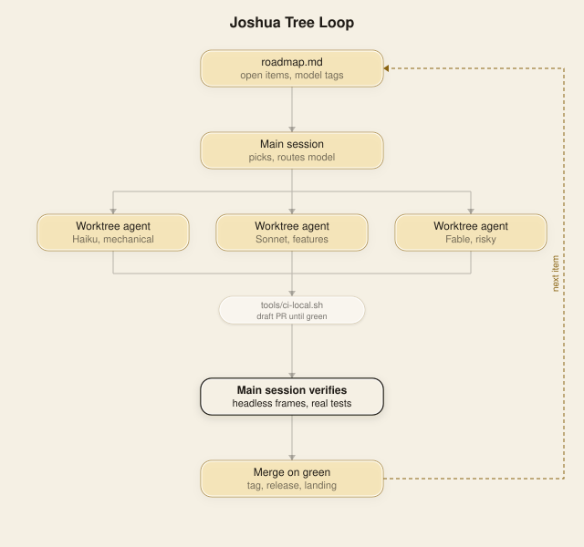

# Joshua Tree loop handoff (2026-10-02, afternoon)

## What the loop is



Build Joshua Tree to 2.0.0, one small PR at a time. docs/VERSIONS.md is the map: 1.8, then 1.9, then 2.0. Each agent gets one shippable slice, about 10 minutes, headless QEMU only, one VM at a time. Two agents at once if either is Fable or Opus, otherwise three. PRs stay draft until `tools/ci-local.sh` is green, then merge on green without asking. While a big PR waits, hold every other merge (main requires up to date branches), and fold small docs changes into a PR that is already open. Keep README, landing, docs/TESTING.md and ARCHITECTURE.md current in the same PR as the change. Zero open issues, always. At 90% session usage, checkpoint and stop starting new work.

## The 2.0.0 gate

2.0.0 ships only when all of these are true and each has a headless check in ci-suite.sh:

1. 1.8 done: a phone home screen, an app grid, one app full screen at a time, a back button.
2. 1.9 done: touch works, an on-screen keyboard, every app readable at phone size.
3. Every app in the APPS[] table runs as its own ring 3 program. No app code left in kernel.c. Done (26 apps: Samantha was last to ship).
4. A check crashes each app on purpose and proves the desktop is still alive after every one. Done for every ring-3 app.
5. Input goes to the focused window only, not a global key pull. Done for ring-3 window apps (1.9.23, `tools/checks/ring3window-check.py`): Reminders beside Notes, keys reach only the focused one. Weather and Stocks are windows too now (`SYS_REFRESH` 398 replaced their exit-code relaunch), so every RING3_APPS row opens as a compositor window. Fallback replaced (2.0 slice): a full window table or failed window launch on the desktop (dock click, `SYS_LAUNCH_REQUEST`) is now an honest refusal, a "Close a window to open <App>" notice plus the serial marker `winrefuse: <App>` (`tools/checks/dockcap-fallback-check.sh` asserts it). Still open, so the item is not fully closed: the blocking launcher and `gui_poll_event`'s pull survive for the phone home grid, the Apps folder (`gui_apps_launch`) and the text-shell `notes`/`chat`/`usertest`/`notetest` commands, which have no compositor loop to host a window. Deleting them needs those three moved onto windows first. WIP (wx slice 2): Apps folder now closes itself and opens the app through gui_multiwin_open / gui_refuse_open; phone grid uses phone_window_run (full-screen window, chevron/Esc kills the task, gui_multiwin_geom is phone-aware); text-shell notes/chat print a pointer. Blocking ring3app_launch, *_ring3_open, gui_poll_event pull and SYS_WINDOW_POLL non-window path are NOT deleted yet: `testapps` (gui_launch loop), weather/stocks_ring3_run and gui_poll_event users still need them. All 26 apps now open as real compositor windows with private memory and per-window input.

## Where things stand

PR #331 ready to merge, auto-merge armed, GitHub CI running. Main merge had silently dropped 27-app tour (landing/v86/embed.js) and face-joshua frames (worker.js proxy), plus phone portfolio fix; all restored and verified locally. CI-local green. When GitHub CI passes, release.yml will tag v2.0.0, create the GitHub release, and the handoff is done.

26 of 26 apps ring-3, compositor windows, private memory, crash isolation. Clipboard (syscall 399), resize, growable memory, smooth type. Mail via Worker (Resend, secret pending). Weather/Stocks refetch. Demo covers 26 apps in 27-app tour. Logo/UI done. Landing synced.

## Next, in order

1. GitHub CI passes, release.yml tags v2.0.0 and creates release.
2. Merge release/2.0.0 back to main, deploy landing.
3. Rewrite this handoff for post-2.0.0 work.
4. 2.0.1 fold: feat/samantha-live, feat/reception (and textselect/editorflash if still red).
5. Security audit of syscalls 393-400.
6. Then the RANKED QUEUE.
Then: 2.1 Music, 2.2 Video, 3.0 on ASRock J4125B-ITX, Strata Kit at 3.1.

## Restart prompt

```
/loop ship Joshua Tree 2.0.0: get PR #331 (release/2.0.0) merged on green GitHub CI, confirm release.yml tagged v2.0.0 and made the GitHub release, deploy landing, rewrite docs/LOOP-HANDOFF.md. Zero open PRs and issues. CI_LOCAL_JOBS=2 never more, one QEMU-heavy job at a time. Stop when v2.0.0 is released.
```
