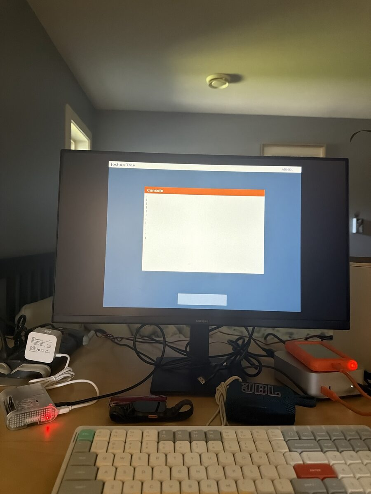
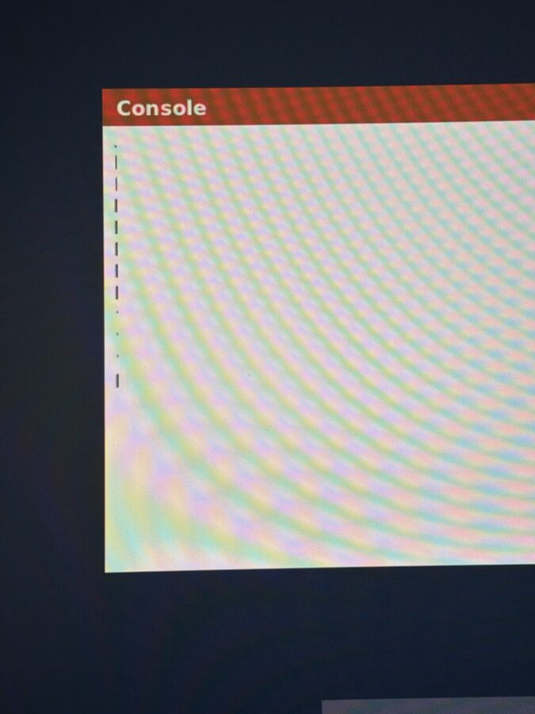

# Raspberry Pi

Joshua Tree booted on a real Pi 4 on 2026-10-06. This page says what works today, what to buy, how to flash the card, and what happened on the real board.

The plan and the milestones live in [ARM64.md](ARM64.md). The case is in [hardware/PI-CASE.md](hardware/PI-CASE.md).

## What works today

| | Status |
|---|---|
| Boots under QEMU's generic ARM machine and prints over the UART | Works. `make -C arch/arm64 run` |
| Boots as a Pi image on QEMU's Pi 4B model, enters at EL2, drops to EL1, prints | Works. `make -C arch/arm64 run-pi` |
| Boots on a real Pi 4 | **Works, 2026-10-06.** First power-on drew the desktop over HDMI. See the log at the bottom. |
| A picture on a monitor | **Works on the real board**, same desktop as QEMU's Pi 4B model: the kernel asks the GPU for a screen through the mailbox, draws a simple desktop and prints the same boot lines in its window that go out over serial, in the same smooth DejaVu type as the main desktop (`tools/checks/arm64-m1c-check.py`). |
| Full screen at the monitor's own size | Built in 2.12.5, waiting on a photo. The kernel asks the firmware how big the monitor is and draws at that size; a 4K monitor gets exactly half each way, so it stays sharp. Proven on QEMU's Pi model with a faked 1080p and 4K monitor. |
| Console text on the real board | Fixed in 2.12.5, waiting on a photo. The first boot showed one thin mark per line because later drawing never left the CPU cache. Every glyph is now cleaned out to memory as it is drawn. |
| Keyboard, mouse, disk, network on the Pi | Not yet. M2 to M4. |

So on day one, watch two things: the text in a serial terminal, and with a monitor plugged in, a simple desktop of plain boxes with the same boot lines written in its white window. If the serial cable is wrong, the monitor still tells you how far the kernel got. If both are blank, it is the SD card or `config.txt`.

## What to buy

- **Raspberry Pi 4 Model B, 4 GB.** The port targets the 4B first. The Pi 5 comes after.
- **A USB-C power supply, 5 V 3 A.** The official one is the safe pick.
- **A microSD card, 16 GB or more.**
- **A USB to serial cable, 3.3 V.** CP2102, FTDI or CH340 all work. This is how you see the output. Make sure it says 3.3 V, not 5 V. The Mac mini only has USB-C, so search "USB-C to TTL serial 3.3V" (or a USB-A one plus an adapter). One end is USB, the other is three loose wires for the header pins. About $10.
- **Three female to female jumper wires.**
- A micro-HDMI to HDMI cable and a monitor, to see the first picture. Plug into the HDMI port next to the USB-C power port (HDMI 0). A USB keyboard and mouse come later (M4).

A local store may have the Pi in stock. Check before you drive. Canada Computers and Memory Express are the usual ones in Vancouver, and PiShop.ca ships from Canada.

## Wire the serial cable

Turn the Pi off. Match the three wires. Never connect the adapter's 5 V or VCC pin to the Pi.

| Pi pin | What it is | Adapter |
|---|---|---|
| 6 | Ground | GND |
| 8 | GPIO14, the Pi's TX | RX |
| 10 | GPIO15, the Pi's RX | TX |

Transmit goes to receive. If you see nothing later, swapping the two data wires is the first fix.

## Build and boot

You need `clang`, `ld.lld` and `qemu-system-aarch64`. The Mac already has them.

```
make -C arch/arm64 pi          # makes arch/arm64/kernel8.img
make -C arch/arm64 run-pi      # try it on QEMU's Pi 4B first
```

## Flash the card

You do not need Raspberry Pi OS. The Pi's firmware boots any `kernel8.img` it finds on a FAT32 card next to five files from the official [raspberrypi/firmware](https://github.com/raspberrypi/firmware/tree/stable/boot) repo. One script does the whole job:

```
tools/flash-pi.sh                    # finds the one mounted FAT32 card
tools/flash-pi.sh "/Volumes/NO NAME" # or name it
```

It builds `kernel8.img`, downloads `bootcode.bin`, `start4.elf`, `fixup4.dat`, `bcm2711-rpi-4-b.dtb` and `overlays/disable-bt.dtbo` (cached in `build/pifw`), copies `tools/pi-config.txt` over as `config.txt` (an existing `kernel8.img` or `config.txt` is kept as `.bak` first), strips the macOS `._` files and ejects. With no argument it only picks a FAT volume on an external disk, and stops if it finds more than one. A card fresh out of the box is already FAT32. A used one: `diskutil eraseDisk FAT32 PI MBRFormat diskN` first (check `diskutil list` twice; the LaCie is also external).

The `config.txt` it writes, from `tools/pi-config.txt`, the one copy:

```
arm_64bit=1
kernel=kernel8.img
kernel_address=0x80000
disable_overscan=1
enable_uart=1
dtoverlay=disable-bt
uart_2ndstage=1
```

`kernel_address` puts the kernel where it is built to run; newer firmware would otherwise load it at 0x200000. `disable_overscan` stops the firmware shrinking the picture inside a black border. `disable-bt` matters. It gives the good UART (the PL011) to the pins on the header. `uart_2ndstage` makes the firmware print before our kernel does, so a blank serial line means wiring and a firmware-only line means the kernel.

If you would rather start from Raspberry Pi OS Lite (64-bit), flash it with Imager, replace `kernel8.img` on the boot partition with ours, and append the lines of `tools/pi-config.txt` to its `config.txt`. Same result, bigger card image.

Then put the card in the Pi. The monitor goes on the micro-HDMI port next to the USB-C power (HDMI 0). The serial cable is optional on day one; the screen shows the same boot lines.

## Boot

With a serial cable, open the terminal. On a Mac the adapter shows up as `/dev/cu.usbserial-something`:

```
ls /dev/cu.usb*
screen /dev/cu.usbserial-0001 115200
```

Power the Pi. You should see:

```
Joshua Tree on ARM64
booted at EL2
EL1
M0 ok
M1 vectors set
M1b mmu on
M1b heap ok
M1 svc ok
tick 1
tick 2
tick 3
M1a ok
M1c fb ok
```

The lines after `M0 ok` are the exception table, the memory map with the caches on, a small heap, and the timer. They run on QEMU's Pi model; on a real board the interrupt controller setup is the part most likely to need a fix. If the output stops after `M1 vectors set`, the memory map is the likely cause on real hardware; if it stops after `M1 svc ok`, it is the interrupt controller. Send me the last line you see.

After the userland lines, the last line is a measurement, for example `@0x80000 fb 1920x1080>1920x1080 p7680 M13x18 a14 ok`. In order: where the firmware really loaded the kernel, the monitor size it reported and the screen we got, the bytes per row, and the console font's self-test (the letter M's width and height, its advance, and the verdict). If the verdict says `FAIL`, the console switches to the old 8x16 VGA font, drawn at a whole-number scale. Photograph that line.

`M1c fb ok` means the GPU gave us a screen and the desktop is drawn: the monitor should show it, with these same lines in the white window (lines printed before the screen came up are replayed there). If the text says `M1c fb ok` and the monitor stays black, the picture is in memory but the GPU is not showing it (photograph both). If it says `M1c mailbox framebuffer refused`, the firmware said no.

That is milestones M0, M1a and the first picture on real hardware. To leave `screen`, press Ctrl-A then K.

The kernel guards against two things a real board may do differently from QEMU: if the firmware leaves the timer speed unset it assumes 54 MHz, and every wait on the GPU's mailbox gives up after a moment and prints `M1c mailbox framebuffer refused` instead of hanging.

## If nothing prints

1. Swap the two data wires.
2. Check the speed is 115200.
3. Check the adapter is 3.3 V and the ground wire is on pin 6.
4. Check `config.txt` matches `tools/pi-config.txt` and the card is fully ejected.
5. `uart_2ndstage=1` is already in `config.txt`, so the Pi's own firmware prints before ours. If you see that and not ours, the kernel is not starting. If you see neither, it is the wiring.
6. Look at the Pi's LEDs. A steady red light is power. A flickering green light is the card being read. A repeating pattern of green blinks is the firmware counting out an error: four means it could not find `start4.elf`, seven means no `kernel8.img`. Either way, re-run `tools/flash-pi.sh`.

If it still fails, send the exact lines you see, even if they look like garbage. Garbage means the speed or the clock is off. Nothing at all means wiring or boot files.

## What is next

| Milestone | What you will see |
|---|---|
| M0 | Text over the serial cable. Built, waiting for a real board. |
| M1 | A picture on a monitor over HDMI. A simple desktop works on QEMU's Pi model; the real Joshua Tree look comes next. |
| M2 | Keyboard, mouse, network and disk, working in QEMU first. Keyboard, mouse, the network card and a disk work. |
| M3 | Every app running on ARM. |
| M4 | The same on the real Pi: SD card, USB, Ethernet. Sound last. |
| M5 | The Pi 5. |

## Why the serial cable matters

Without it, every test is: build, swap the card, photograph the monitor, guess. With it:

- **The exact error.** The Pi prints every step to the Mac, even when the screen is blank, so a failure names its own line.
- **No more card swaps.** A tiny loader goes on the card once; after that each new build is sent down the cable and booted. This is the "auto update" path. Pulling updates from GitHub by itself needs networking and TLS in the kernel, which is much further out.
- **Typing before USB works.** Serial is two-way, so the Mac's terminal can be Joshua Tree's keyboard while the USB driver is still being built.

## Wireless

A Bluetooth dongle and a Logitech receiver are both USB devices, so they wait on the USB driver. The receiver then works as a plain USB mouse and keyboard with no extra code. The Pi's own Wi-Fi and Bluetooth chip (CYW43455) needs a closed firmware file and a full wireless stack. Not scheduled; wired Ethernet comes first.

## Time estimates (2026-10-06)

Guesses, not measurements. Updated as each one lands.

| Milestone | Estimate |
|---|---|
| Full-screen, sharp picture at the monitor's own size; console text fixed; Steve Jobs tribute line | Same day |
| Serial loader (no card swaps) and typing from the Mac | The day the cable arrives |
| USB keyboard and mouse on the real Pi | Days. Driver built and tested in QEMU first; the Pi's own PCIe and USB chip setup can only be tried on the board |
| The real desktop and dock (`drivers/window.c`) on the Pi | About a week |
| Apps running on the Pi | One to three weeks |
| Files saved to the SD card, internet over Ethernet | One to two weeks, alongside the apps |
| Fully usable Joshua Tree on the Pi, the 3.0 gate | Roughly three to six weeks |

## The fan and the case

The little fan runs off the header: red to pin 4 (5 V), black to pin 6 (ground). Pin 6 is also the serial cable's ground, so if both are wired, share it or use pin 9, which is another ground. Heat sinks go on the big SoC chip and the smaller chips next to it. For the printed case, see [hardware/PI-CASE.md](hardware/PI-CASE.md).

## Log

Newest first. Each entry says what was tried on the real board and the last line seen.

- **2026-10-06, evening: the console marks explained (2.12.5, not yet flashed).** The photo shows 12 marks, one for each line printed before the screen came up, and each is the left edge of that line's first letter. The screen lives in cached memory, and the GPU only sees what the kernel cleans out of the cache. The kernel cleaned once, after drawing the first page. The later lines filled the window, the console wiped it and carried on, and none of that was cleaned. The wipe went straight to memory because it overwrote whole cache lines, but the two pixel columns just left of a line boundary kept the old text. That is the column of marks. The font was fine all along. 2.12.5 cleans every glyph and every wipe, draws at the monitor's own size, pins the load address, and ends the log with a diagnostic line. Also on screen now: "Steve Jobs, 1955 to 2011. Thank you.", fifteen years on.

- **2026-10-06, first boot.** Pi 4 Model B 4 GB, 32 GB card, heat sinks, case, fan, the official 27 W supply. Flashed from the Mac without Raspberry Pi OS: the five firmware files straight from `raspberrypi/firmware` plus a 151 KB `kernel8.img` built that afternoon (now `tools/flash-pi.sh`). First power-on: red light only, black screen, because the card had gone in after power. Unplug, reseat, replug: the desktop came up over HDMI 0 on a Samsung monitor. Menu bar reads `Joshua Tree` and `ARM64` in DejaVu, the Console window and the dock box are drawn. The boot lines inside the Console render as a thin column of marks at the left edge instead of text; the title text is fine, so the font works. A close-up shows exactly 13 marks for the 13 boot lines, so every line arrives and every character in it draws as a one-pixel mark with no advance: the bytes reaching the console are not the ones the font table knows. No serial cable yet, so the serial log is unread.





Joshua Tree 3.0 ships when it boots the desktop on a real Pi.
