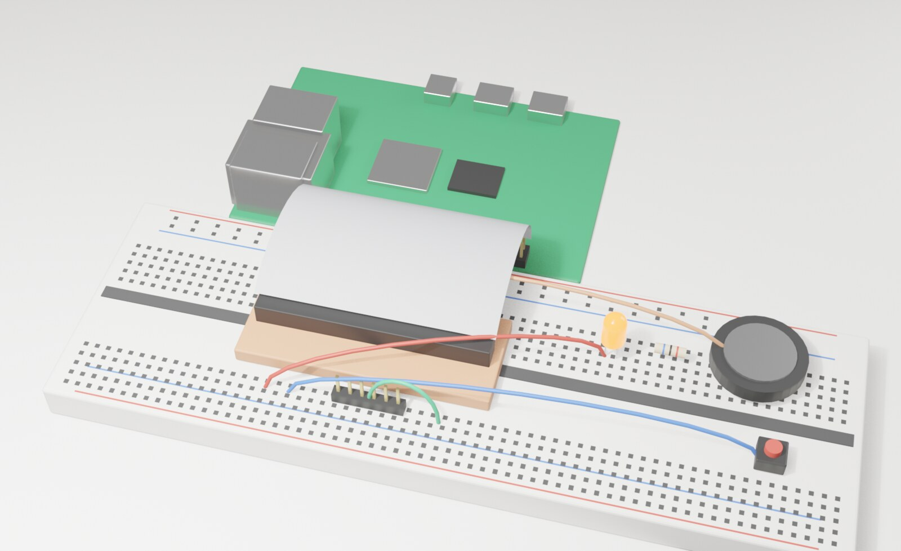

# The breadboard prototype

A Raspberry Pi 4 and a breadboard, so the parts Joshua Tree needs next can be tried without soldering. The picture is drawn by `tools/gen/breadboard.py` in Blender. When the wiring changes, change both.

## What you need

- A Raspberry Pi 4 with the Joshua Tree card (`tools/flash-pi.sh`).
- A full-size breadboard and a 40-pin breakout with its ribbon cable (a "T-cobbler").
- A USB to serial cable, 3.3 V only.
- One LED and a 330 ohm resistor, one push button, a small speaker with a PAM8302 amp board, jumper wires.

## Wire it

Power the Pi off first. Pin numbers are the Pi's physical pins, 1 to 40.

| Part | Pi pin | Goes to |
|---|---|---|
| Ribbon cable | all 40 | the breakout, red stripe at pin 1 |
| Serial cable | 6 GND, 8 TX, 10 RX | cable GND, RX, TX (crossed) |
| LED | 11 (GPIO17) | resistor, LED, then the ground rail |
| Button | 13 (GPIO27) | button, then the ground rail |
| Speaker | 12 (GPIO18) | amp input; amp to the speaker, amp power from pin 2 (5 V) and ground |
| Ground rail | 9 | the blue rail on both sides |

## What works today

Only the serial cable. Joshua Tree prints every boot line on it (`docs/RASPBERRY-PI.md`). The LED, the button and the speaker are wired for the drivers that come next: a GPIO driver for the LED and button, then PWM sound on GPIO18. Until then they sit there quietly.
