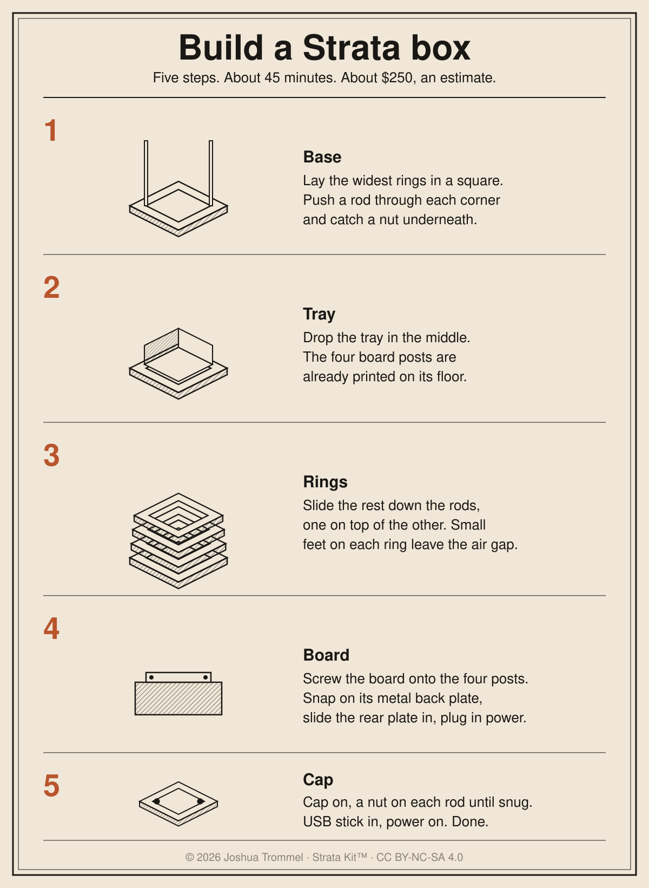

# Build a Strata box

Five steps. About 45 minutes once you have the parts. About $250 with the board, RAM and drive, and every price here is an estimate until a real quote lands. The long version with every part ID is [`ASSEMBLY.md`](ASSEMBLY.md).

## The five steps

1. **Base.** Lay the four widest ring pieces in a square, push a rod through each corner, catch a nut underneath.
2. **Tray.** Drop the tray in the middle. The board posts are already on its floor.
3. **Rings.** Slide the rest of the rings down the rods, one on top of the other. The little 2 mm feet on each ring leave the air gap for you.
4. **Board.** Screw the board onto the four posts, snap its metal back plate on, push the rear plate in behind it, plug in power.
5. **Cap.** Put the cap on, spin a nut onto each rod until snug. Plug in the USB stick and boot.

## What you need

| Item | Qty | Where to buy | Estimate |
|---|---|---|---|
| Printed parts (30 pieces, 21 files in `stl/`) | 1 set | JLC3DP or your own printer | $40 to 75 printed, about $9 at home |
| ASRock J4125B-ITX board | 1 | Walmart or Beach Audio listing | about $120 |
| 8GB DDR4 laptop RAM | 1 | any computer shop | about $25 |
| 128GB SATA drive and a SATA cable | 1 | any computer shop | about $20 |
| Small power supply for mini-ITX (picoPSU) | 1 | any computer shop | about $30 |
| M3 threaded rod 65 mm (4), M3 nuts (8), M3x8 screws (4) | 1 bag | hardware store or Amazon | about $7 |
| 16GB USB stick with Joshua Tree on it | 1 | ships in the kit | about $8 |

Total about $250, mostly estimate. Only the board price comes from a real listing.

## Pick your path

### I want it done for me

1. Upload every file in `stl/` to jlc3dp.com (3D Printing). Set each quantity from `stl/manifest.json`.
2. Order the board from the listing above, with the rest of the table.
3. When the box arrives, follow the five steps. You need a small Phillips screwdriver and nothing else. Nuts go in by hand.

### I want to print it myself

1. Printer: Bambu A1 mini, 0.4 mm nozzle, PLA or PETG, no supports.
2. Every file prints flat, exactly as it is. Rings and cap: 0.2 mm layers, 3 walls, 15% infill. Tray: 20% infill. Rear plate: 100% infill.
3. Print each file the number of times `manifest.json` says. About 450 g of plastic and around 30 hours, both estimates.
4. Sand any blob off the edges. Do not scale a part.

## Something went wrong

| It does this | Do this |
|---|---|
| A ring will not slide down | Sand the rod hole edge. Do not scale the file. |
| The stack rocks | One nut is loose. Tighten the four top nuts a little at a time. |
| The back plate will not go in | Sand its edges. It is a 0.2 mm fit. |
| The board screws will not bite | Start each screw with a firm push and two turns. The posts are plastic. |
| Black screen on first boot | Check the USB stick is in a rear port, tap F11, pick the stick with UEFI in its name. |
